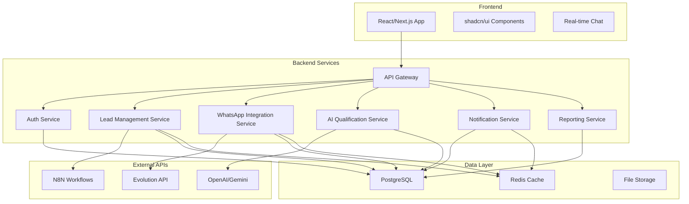
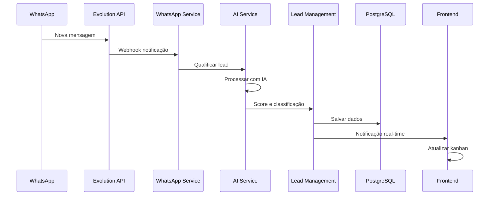
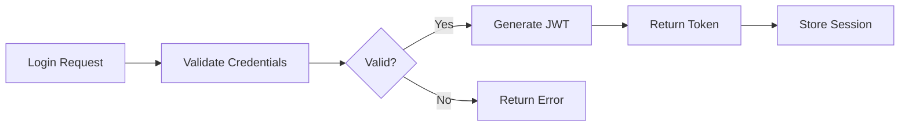
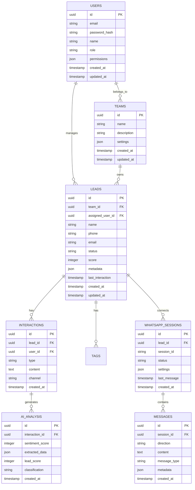
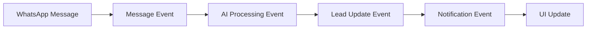
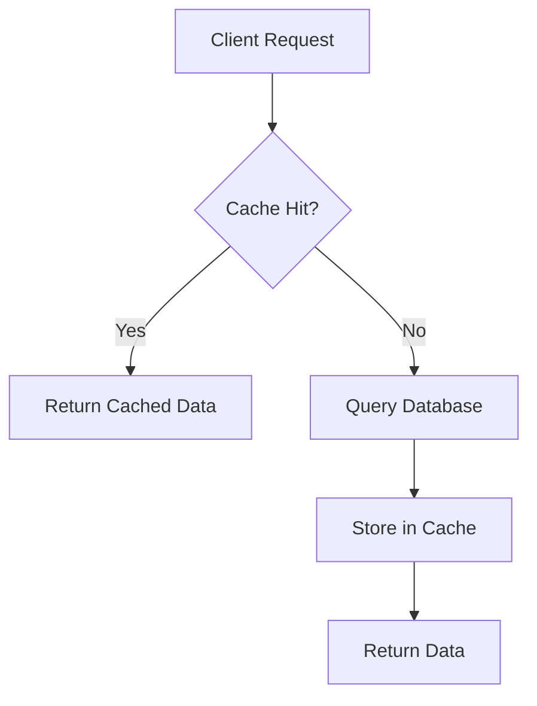
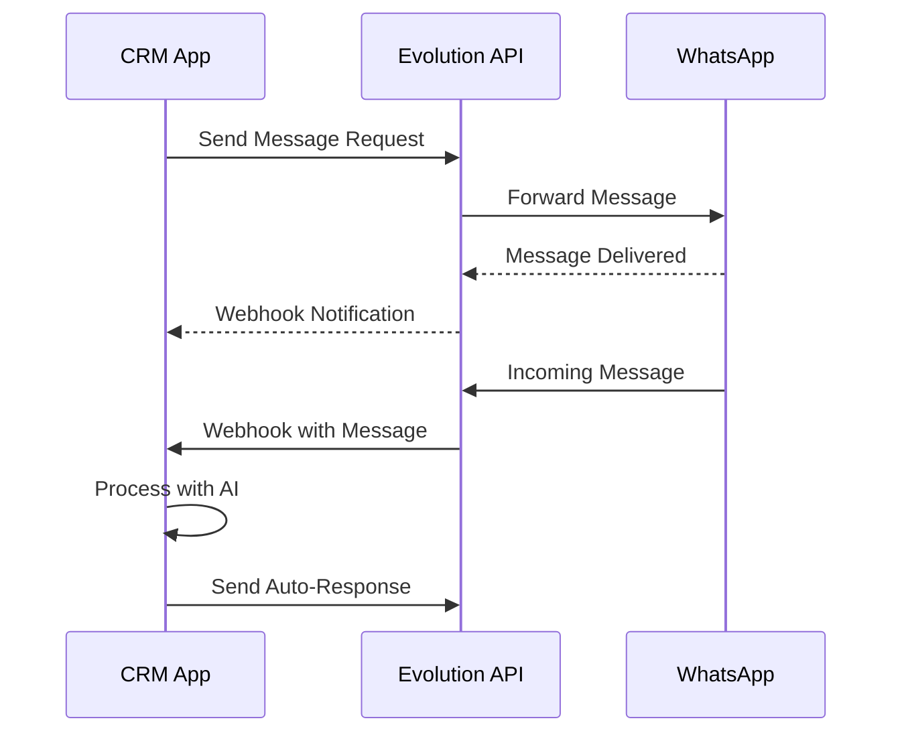
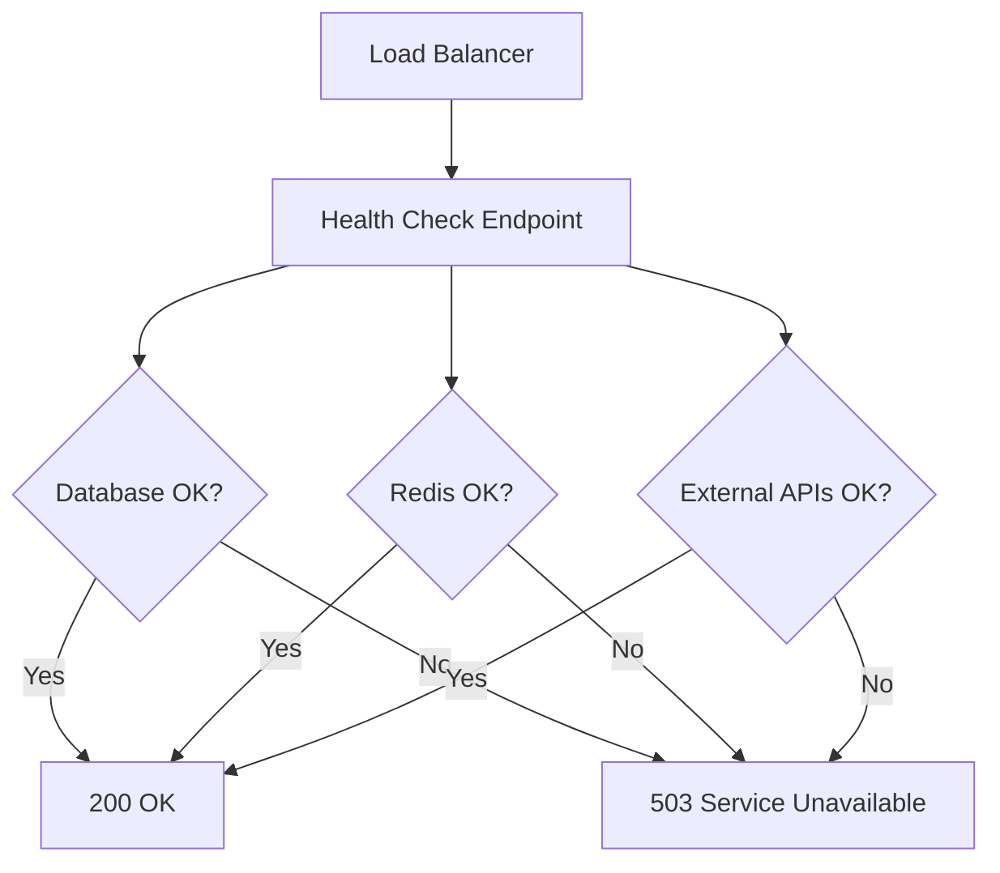
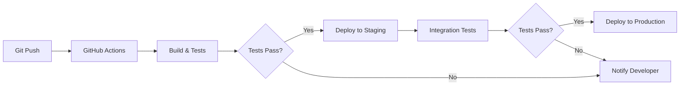
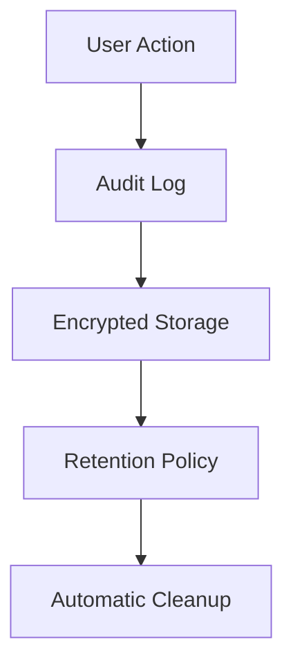

# Arquitetura do Sistema

# Documentação de Arquitetura - Sistema de Gestão de Leads com IA

## 1. Visão Geral da Arquitetura

O sistema é uma plataforma SaaS desenvolvida com arquitetura moderna baseada em microserviços, utilizando React/Next.js no frontend e Node.js no backend, com PostgreSQL como banco de dados principal.

### 1.1 Arquitetura de Alto Nível



### 1.2 Fluxo de Dados Principal



## 2. Componentes de Sistema

### 2.1 Frontend (React/Next.js)

**Responsabilidades:**
- Interface do usuário responsiva
- Gestão de estado da aplicação
- Comunicação real-time via WebSockets
- Renderização de componentes shadcn/ui

**Tecnologias:**
- Next.js 14+ (App Router)
- TypeScript
- Tailwind CSS
- shadcn/ui
- Zustand para gestão de estado
- Socket.io-client para real-time

### 2.2 API Gateway

**Responsabilidades:**
- Roteamento de requisições
- Autenticação e autorização
- Rate limiting
- Logging centralizado

**Implementação:**
- Express.js com middleware customizado
- JWT para autenticação
- CORS configurado
- Helmet para segurança

### 2.3 Serviços Backend

#### 2.3.1 Auth Service


#### 2.3.2 Lead Management Service
**Funcionalidades:**
- CRUD de leads
- Pipeline/Kanban management
- Histórico de interações
- Sistema de tags e categorização

#### 2.3.3 WhatsApp Integration Service
**Responsabilidades:**
- Integração com Evolution API
- Gerenciamento de sessões WhatsApp
- Templates de mensagens
- Automação de respostas

#### 2.3.4 AI Qualification Service
**Funcionalidades:**
- Análise de sentimento
- Scoring automático de leads
- Classificação por critérios
- Extração de informações relevantes

## 3. Modelo de Dados

### 3.1 Diagrama ER



## 4. Decisões Arquiteturais

### 4.1 Escolha do Stack Tecnológico

| Componente | Tecnologia | Justificativa |
|------------|------------|---------------|
| Frontend | Next.js + React | SSR, performance, SEO, ecosystem maduro |
| UI Library | shadcn/ui | Customização total, componentes modernos |
| Backend | Node.js + Express | JavaScript full-stack, performance para I/O |
| Banco de Dados | PostgreSQL | ACID, JSON support, escalabilidade |
| Cache | Redis | Performance, sessões, pub/sub |
| Deploy | Vercel | Otimizado para Next.js, CI/CD automático |

### 4.2 Padrões Arquiteturais

#### 4.2.1 Arquitetura em Camadas
- **Presentation Layer:** React components
- **Business Logic Layer:** API services
- **Data Access Layer:** Database repositories
- **Infrastructure Layer:** External APIs e serviços

#### 4.2.2 Event-Driven Architecture


### 4.3 Segurança

#### 4.3.1 Autenticação e Autorização
- JWT com refresh tokens
- Role-based access control (RBAC)
- Rate limiting por usuário
- Validação de entrada em todas as APIs

#### 4.3.2 Proteção de Dados (LGPD)
- Criptografia de dados sensíveis
- Logs de auditoria
- Política de retenção de dados
- Consentimento explícito para processamento

### 4.4 Escalabilidade

#### 4.4.1 Estratégias de Cache


#### 4.4.2 Otimizações de Performance
- Connection pooling no PostgreSQL
- Lazy loading de componentes
- Compressão gzip/brotli
- CDN para assets estáticos

## 5. Integração com Serviços Externos

### 5.1 Evolution API (WhatsApp)


### 5.2 Integração com IA
**Providers Suportados:**
- OpenAI GPT-4/GPT-3.5
- Google Gemini
- Anthropic Claude

**Funcionalidades:**
- Análise de sentimento
- Extração de entidades
- Classificação de leads
- Geração de respostas automáticas

### 5.3 N8N Integration
- Webhook endpoints para automação
- Triggers baseados em eventos
- Workflows customizáveis
- Monitoramento de execução

## 6. Monitoramento e Observabilidade

### 6.1 Logging
```javascript
// Estrutura de logs padronizada
{
  timestamp: "2024-01-01T00:00:00.000Z",
  level: "info|warn|error",
  service: "lead-management",
  userId: "uuid",
  action: "create_lead",
  metadata: {
    leadId: "uuid",
    source: "whatsapp"
  }
}
```

### 6.2 Métricas de Sistema
- Tempo de resposta das APIs
- Taxa de erro por endpoint
- Número de leads processados
- Performance da IA
- Uso de recursos

### 6.3 Health Checks


## 7. Estratégia de Deploy e CI/CD

### 7.1 Pipeline de Deploy


### 7.2 Ambientes
- **Development:** Local development
- **Staging:** Vercel Preview Deployment
- **Production:** Vercel Production

### 7.3 Database Migrations
- Versionamento com Prisma/Drizzle
- Rollback automático em caso de erro
- Backup antes de migrações críticas

## 8. Considerações de Compliance

### 8.1 LGPD
- **Consentimento:** Opt-in explícito para processamento
- **Minimização:** Coleta apenas dados necessários
- **Transparência:** Política de privacidade clara
- **Portabilidade:** Export de dados do usuário
- **Esquecimento:** Exclusão completa de dados

### 8.2 Auditoria


## 9. Roadmap de Evolução

### 9.1 Fases de Desenvolvimento
1. **MVP (60 dias):** Core CRM + WhatsApp + IA básica
2. **V1.1:** Integrações avançadas + Analytics
3. **V1.2:** Mobile app + API pública
4. **V2.0:** Multi-tenant + Advanced AI

### 9.2 Tecnologias Futuras
- GraphQL para APIs mais eficientes
- WebRTC para chamadas de voz
- Machine Learning on-premise
- Blockchain para auditoria imutável

---

**Documento criado em:** 2026-03-18  
**Versão:** 1.0  
**Próxima revisão:** 2026-04-18

---
*Tipo: architecture*
*Gerado pelo ForgeAI em 18/03/2026*
